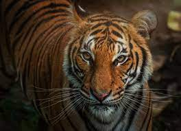
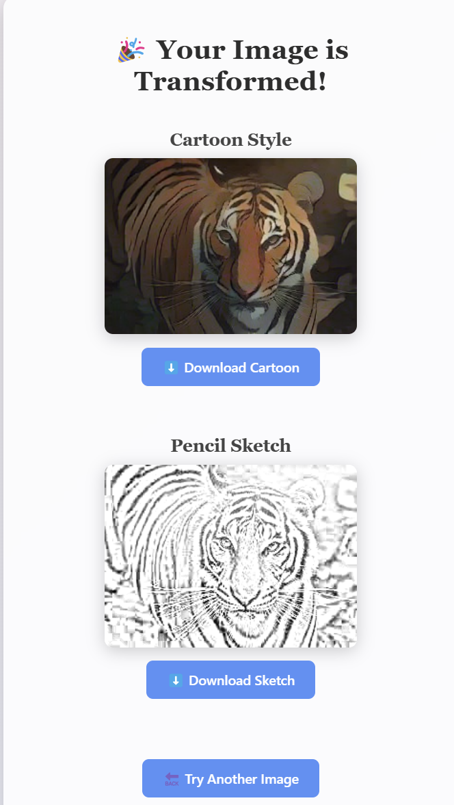

# 🎨 Cartoon Sketchify

**Cartoon Sketchify** is an AI-powered web app that turns your real-world photos into:
- 🧑‍🎨 **Ghibli-Style Cartoon Images**
- ✏️ **Pencil Sketches**

All using **Digital Image Processing (DIP)** techniques and a **White-box Cartoonization deep model**!

> 🚀 Final Year College Project (DIP + AI + Flask)

---

## 🌟 Key Features

- Upload any real-world image (JPG, PNG, etc.)
- Instant cartoonized version (Anime / Ghibli style)
- Instant black-and-white pencil sketch version
- Stylish, fully responsive frontend
- Ready-to-run Flask backend
- No internet needed (runs locally!)

---

## 🖼️ Project Preview

| Upload Image Page | Cartoon + Sketch Output |
|-------------------|-------------------------|
|  |  |

---

## 🧠 Technologies & Methods Used

| Technology         | Purpose                                  |
|--------------------|------------------------------------------|
| **OpenCV**         | Image preprocessing & sketch generation |
| **TensorFlow 1.x** | Cartoonization model inference          |
| **tf-slim**        | U-Net generator layers                  |
| **Flask**          | Web server and routing                  |
| **HTML + CSS**     | Stylish, responsive frontend            |
| **Guided Filter**  | Smoothing cartoon outputs               |
| **Gaussian Blur**  | Blur for better pencil sketches         |
| **Image Inversion**| Sketch pipeline with inverted blurring  |

---

## ⚙️ How to Set Up Locally

1. **Clone the repository**

```bash
git clone https://github.com/Taha-Gituser/cartoon-sketchify.git
cd cartoon-sketchify
```

2. **Create and activate a virtual environment**

```bash
python -m venv venv
venv\Scripts\activate    # (on Windows)
```

3. **Install all dependencies**

```bash
pip install -r requirements.txt
```

4. **Run the Flask app**

```bash
python app.py
```

5. **Open the app in your browser**

Visit [http://127.0.0.1:5000](http://127.0.0.1:5000)

---

## 📁 Project Folder Structure

```
📂 cartoon-sketchify/
├── app.py                   # Flask backend (Main file)
├── requirements.txt         # Dependency list
├── static/
│   ├── style.css             # Custom CSS styles
│   ├── results/              # Generated outputs (cartoon + sketch)
│   └── uploads/              # Uploaded input images
├── templates/
│   ├── index.html            # Upload page
│   └── result.html           # Result display page
├── temp_input/               # Temporary folder for cartoonizer
├── test_code/                # Cartoonization model code
│   ├── cartoonize.py
│   ├── network.py
│   ├── guided_filter.py
│   ├── saved_models/         # Pretrained model checkpoint
```

---

## 🙌 Made By

Taha | Computer Science Engineering (CSE)  
Guided by: [White-box Cartoonization - Wang et al., CVPR 2020]

---

## 🌟 Star this repo if you like the project!

