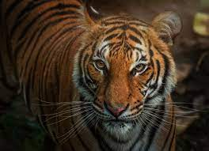
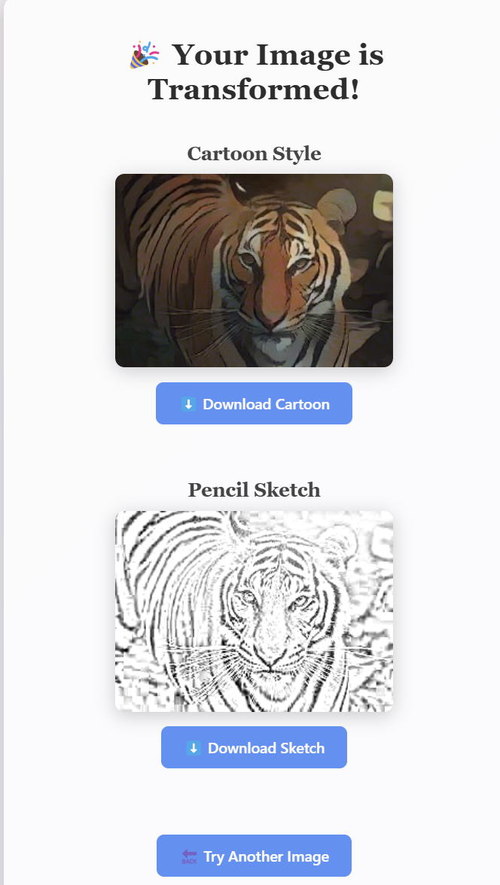

#  Cartoon Sketchify
[](https://flask.palletsprojects.com/)
[](https://www.tensorflow.org/)
[](https://www.python.org/)
[]()
[]()


Transform your real-world photos into:
-  **Ghibli-Style Cartoon Images**
-  **Pencil Sketches**

All using **Digital Image Processing (DIP)** and **AI Deep Models** – running locally on your machine with blazing speed! 🚀


---

##  Key Features

-  Upload any real-world image (JPG, PNG, JPEG)
-  Get Instant Cartoonized Ghibli-style output
-  Get Instant Pencil Sketch output (pure black & white)
-  Stylish, fully responsive frontend (mobile + desktop)
-  Fast local execution with Flask (no internet needed)
-  High-quality outputs using Deep Learning + OpenCV

---

## 🖼 Project Preview

|  Upload Image Page |  Cartoon +  Sketch Output |
|:--------------------:|:----------------------------:|
|  |  |

---

##  Technologies & Methods Used

| Technology         | Purpose                                  |
|--------------------|------------------------------------------|
| **OpenCV**         | Image preprocessing & sketch generation |
| **TensorFlow 1.x** | Cartoonization model inference          |
| **tf-slim**        | U-Net generator architecture            |
| **Flask**          | Web server and routing                  |
| **HTML + CSS**     | Beautiful, responsive frontend styling  |
| **Guided Filter**  | Smooth cartoon output                  |
| **Gaussian Blur**  | Enhance pencil sketch                  |
| **Image Inversion**| Sketch pipeline with blurring magic     |

---

## ⚙️ How to Set Up Locally

1. **Clone this repository**

```bash
git clone https://github.com/Taha-Gituser/cartoon-sketchify.git
cd cartoon-sketchify
```

2. **Create and activate a virtual environment**

```bash
python -m venv venv
# Windows
venv\Scripts\activate
```

3. **Install all dependencies**

```bash
pip install -r requirements.txt
```

4. **Run the Flask app**

```bash
python app.py
```

5. **Open the app in your browser**

```
http://127.0.0.1:5000
```

---

## 📁 Project Folder Structure

```
📂 cartoon-sketchify/
├── app.py                   # Flask backend (Main controller)
├── requirements.txt         # Python dependencies
├── static/
│   ├── style.css             # Custom frontend styles
│   ├── results/              # Generated cartoon/sketch outputs
│   └── uploads/              # Uploaded input images
├── templates/
│   ├── index.html            # Upload page
│   └── result.html           # Result display page
├── temp_input/               # Temporary working folder
├── test_code/                # Cartoonization deep model code
│   ├── cartoonize.py
│   ├── network.py
│   ├── guided_filter.py
│   ├── saved_models/         # Pretrained model checkpoints
```

---

##  Made by

Developed independently by [**Taha**](https://github.com/Taha-Gituser)  
Computer Science Engineering (CSE) 🎓

---

## 🌟 If you love it, don't forget to ⭐ Star this repo!

---
